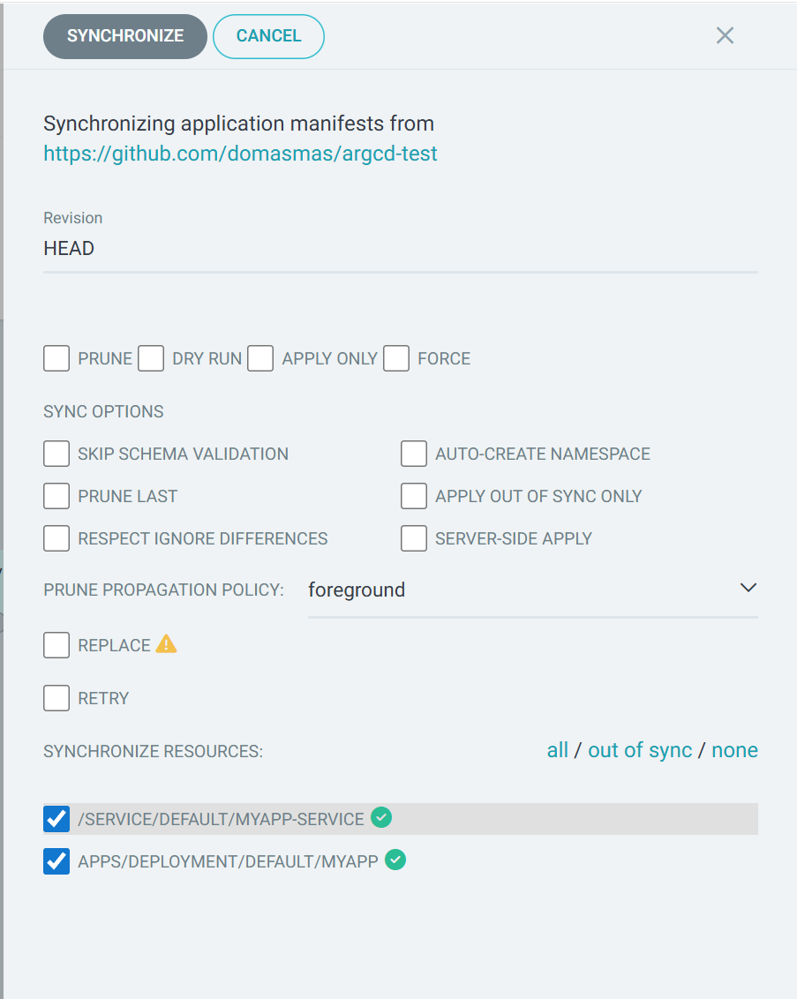

# Argo CD Sync Form Deep-Dive

This exercise demonstrates precise control on Argo CD's **Sync** dialog using the five color-themed apps (green, blue, yellow, purple, red). Each exercise shows how a setting changes the outcome when you synchronize the `sync-form-lab` application.

> **Heads-up:** The **Red App** intentionally throws an exception a few seconds after start-up. You'll use it to observe retry, force, and replace behaviour during sync.

## 1. Prerequisites

- Argo CD installed locally (use `practise/2. argo-cd-local/setup.ps1` if needed).
- This repository pushed to a Git host reachable by Argo CD.
- `kubectl` configured to point at the same cluster Argo CD manages.
- The color app images published (run the build scripts under `resources/<color>-app/` if you need fresh images).

## 2. Register the lab application

From the repo root:

```powershell
cd practise/4. argo-sync-form/domas
./deploy.ps1 -RepositoryUrl "https://github.com/<your-username>/argcd-test" -Revision main
```

This creates an Argo CD application called `sync-form-lab` pointed at the manifests in this folder. The manifest currently deploys the **Green App** into a namespace named `sync-form`.

Open the Argo CD UI (usually http://localhost:30088) and locate the application. It will appear **OutOfSync** because no sync has ever been run.

## 3. Sync form cheat sheet



| Control                                                                | What it does                                                        | Suggested scenario                                                             |
| ---------------------------------------------------------------------- | ------------------------------------------------------------------- | ------------------------------------------------------------------------------ |
| **Prune**                                                              | Deletes cluster resources that exist live but not in Git            | Manually create an extra `ConfigMap` and watch it vanish when Prune is checked |
| **Dry Run**                                                            | Renders manifests and diffs without applying changes                | Preview a switch from Green → Blue                                             |
| **Apply Only**                                                         | Avoids pruning even if prune checkbox is set                        | Compare with previous step to see resources linger                             |
| **Force**                                                              | Replaces immutable fields using `kubectl replace --force` semantics | Swap between Blue ↔ Yellow rapidly to observe rollout                          |
| **Sync Options** (Skip Schema Validation, Auto-Create Namespace, etc.) | Tweak underlying `kubectl apply`/controller behaviour               | Tasks below walk through each option                                           |
| **Prune Propagation Policy / Prune Last**                              | Control deletion order when pruning                                 | Try deleting Service first vs last                                             |
| **Replace**                                                            | Use `kubectl replace` instead of apply                              | Reset a deployment stuck with immutable field changes                          |
| **Retry**                                                              | Configure automatic retry when sync fails                           | Pair with the crashing Red App                                                 |
| **Synchronize resources** filters                                      | Limit sync to selected resources                                    | Update only the Deployment or only the Service                                 |

Keep this table open while working through the scenarios.

## 4. Scenario walkthroughs (with behind-the-scenes tips)

Work through the scenarios in order. Assume you are starting with a clean repository that exactly matches `main` and the Argo CD app is named `sync-form-lab`.

### Useful areas of the Argo CD UI

When you click the application tile you will see the horizontal action bar: **DETAILS**, **DIFF**, **SYNC**, **SYNC STATUS**, **HISTORY AND ROLLBACK**, etc.

- Use **DETAILS → Events** to watch individual Kubernetes API calls.
- Use **DIFF** to compare Git vs live state before and after each experiment.
- Use **SYNC** to open the right-hand _Synchronizing application manifests_ drawer where you toggle checkboxes.
- Use **SYNC STATUS** after every run to confirm what changed.
- Use **HISTORY AND ROLLBACK** to review previous operations and the options that were used.

Tip: run `kubectl get pods -n sync-form --watch` and `kubectl get events -n sync-form --watch` in separate terminals if you prefer a command-line view of what Kubernetes is doing.

### 4.1 First sync – Auto-create namespace

1. Confirm the namespace does not exist yet: `kubectl get ns sync-form` (you should see _NotFound_).
2. In the Argo CD UI click **SYNC**.
3. Tick **Auto-Create Namespace**. Leave every other option unchecked.
4. Click **SYNCHRONIZE**. If see an error, or syncing gets stuck for more than 1 minutes, try couple times again.
5. Immediately open **DETAILS → Events** and note the message `namespace/sync-form created` followed by creation of the Service and Deployment.
6. In a terminal run `kubectl get ns sync-form` and `kubectl get pods -n sync-form`. You should see one pod named similar to `sync-form-app-xxxx` in `Running` state.
7. Visit http://localhost:30087 to verify the Green App is reachable.

### 4.2 Dry run vs apply (showing why dry run doesn’t change the cluster)

1. Open `practise/4. argo-sync-form/domas/k8s/deployment.yaml` in your editor. Locate the line `image: domasmasiulis/green-app:latest` and change it to `image: domasmasiulis/blue-app:latest`.
2. Save the file, then run:
   ```powershell
   git status
   git commit -am "Switch lab deployment to blue app"
   git push
   ```
3. Back in Argo CD, click **SYNC**.
4. Tick only **Dry Run**. The right-hand drawer should show `PRUNE`, `DRY RUN`, etc. with only `DRY RUN` highlighted.
5. Click **SYNCHRONIZE**. A toast message appears saying the operation succeeded in dry-run mode.
6. Click **DIFF** to view the rendered differences (it highlights the image change).
7. Open **SYNC STATUS** to confirm no resources were modified. The status line indicates “Dry Run” and the resource counts remain unchanged.
8. In your terminal run `kubectl get pod -n sync-form -o jsonpath='{.items[0].spec.containers[0].image}'`. The output is still `domasmasiulis/green-app:latest`, proving the cluster wasn’t touched.
9. (Optional insight) Change the image _again_ in Git to the unstable Red App (`image: domasmasiulis/red-app:latest`), commit, push, and perform another dry run. The UI still reports success because the manifest renders; if you click **DIFF** you can preview the change without risking the crash that would happen during a real sync.
10. To perform the actual rollout, update Git once more to the desired healthy color (e.g., switch back to Blue by editing the file or reverting) and push. In Argo CD run **SYNC** with **Dry Run** unchecked. After the operation finishes, run the jsonpath command again—you should now see the blue image running.

> **Resetting for the next scenario:** keep the Deployment pointing at `domasmasiulis/blue-app:latest` unless the upcoming steps instruct you otherwise.

### 4.3 Prune vs Apply Only

1. Create a resource that is _not_ tracked in Git:
   ```powershell
   kubectl create configmap stray-settings --from-literal=color=rogue -n sync-form
   ```
2. Verify it exists with `kubectl get configmap stray-settings -n sync-form`.
3. In Argo CD click **SYNC**, tick **Prune**, leave everything else off, then click **SYNCHRONIZE**.
4. Open **DETAILS → Events** and look for `configmap/stray-settings deleted`. `SYNC STATUS` shows one deleted resource.
5. Confirm deletion with `kubectl get configmap stray-settings -n sync-form` (should report “NotFound”).
6. Re-create the ConfigMap so you can contrast behaviours:
   ```powershell
   kubectl create configmap stray-settings --from-literal=color=rogue -n sync-form
   ```
7. Run **SYNC** again, this time tick **Prune** _and_ **Apply Only**. This combination tells Argo CD to render prune information but not execute deletions.
8. After the sync, **SYNC STATUS** shows “Prune skipped because apply-only mode is enabled”. The ConfigMap still exists if you query it with kubectl.
9. Delete the ConfigMap manually (`kubectl delete configmap stray-settings -n sync-form`) so later scenarios start clean.

### 4.4 Force vs Replace (dealing with immutable fields)

1. Change the container port in Git: edit `deployment.yaml` and set `containerPort: 8081`. Commit and push.
2. Run a sync with no special options. **SYNC STATUS** should show a failed operation with the message `field is immutable` (also visible in the event log).
3. Click **HISTORY AND ROLLBACK** to inspect the failed entry and confirm it lists “Force: false, Replace: false”.
4. Retry the sync with **Force** checked. The Events log will show the old ReplicaSet being scaled down and a new one created. Expect a brief 1–2 second disruption of traffic at http://localhost:30087.
5. Roll back the change by editing the file back to port 8080, commit, push, and run one more sync—this time try checking **Replace** instead of Force. You’ll notice the ReplicaSet is recreated in a single `replace` call. After it succeeds, the pod should expose port 8080 again.

### 4.5 Prune propagation policy & prune last

1. Add a temporary resource so there’s something to prune. For example, create a copy of the service manifest named `extra-service.yaml` with a different metadata name (`sync-form-app-temp`). Reference it in `kustomization.yaml`.
2. Commit and push. Run a normal sync so both services exist (verify with `kubectl get svc -n sync-form`).
3. Remove `extra-service.yaml` from disk and from `kustomization.yaml`, commit, and push—Git no longer contains the resource.
4. Open **SYNC**, tick **Prune**, set **Prune Propagation Policy** to `background`, and sync. Argo CD issues the deletion and returns immediately. In a terminal `kubectl get svc -n sync-form --watch` shows the extra service disappearing moments later.
5. Repeat the experiment with `foreground`. This time the sync waits until Kubernetes confirms the deletion before reporting success—watch **DETAILS → Events** to see the delay.
6. Tick **Prune Last** and sync once more while removing another resource (perhaps a temporary ConfigMap). Observe that updates happen first and deletions are queued for the end of the operation.
7. Remove any temporary files you created (e.g., delete `extra-service.yaml` from your working tree) and push the cleanup commit so the repo returns to the baseline manifests before you continue.

### 4.6 Retry with the Red App (intentional failure)

1. Edit `deployment.yaml` and set the image to `domasmasiulis/red-app:latest`. Commit and push.
2. Click **SYNC**, expand **Retry**, set **Limit** to `3`, **Backoff** to `5` seconds. Leave other boxes unchecked.
3. Sync. Within seconds the pod crashes. **DETAILS → Events** shows repeated `Back-off restarting failed container` messages. **SYNC STATUS** increments the retry attempt counter until the limit is reached.
4. Observe the entries under **HISTORY AND ROLLBACK**—they capture the retry settings for each attempt.
5. Restore the image to a healthy color (e.g., Blue), commit, push, and run one more sync to return the app to normal operation.

### 4.7 Apply out-of-sync only

1. Without touching Git, run `kubectl scale deployment sync-form-app -n sync-form --replicas=3`. The live cluster now deviates from Git.
2. In Argo CD the application shows OutOfSync. Click **SYNC** and tick **Apply Out of Sync Only**.
3. Sync. Argo CD updates only the Deployment because it’s the only object that drifted. The Service is skipped.
4. Check **SYNC STATUS** to confirm only the Deployment was applied. In the Events log you’ll see a single `deployment updated` entry.
5. Verify the pod count returned to 1 using `kubectl get deploy sync-form-app -n sync-form`.

## 5. Clean up

When finished:

```powershell
kubectl delete application sync-form-lab -n argocd
kubectl delete namespace sync-form
```

## 6. Extension ideas

- Combine this lab with the rollback exercises to see how Sync options interact with history reconciliation.
- Add `ignoreDifferences` rules to the Application and experiment with toggling **Respect Ignore Differences**.
- Use the **Last Applied** view in the Argo CD UI to correlate your sync options with the live manifest.

Have fun exploring! The color apps give immediate visual feedback while you master every checkbox in the Sync form.
